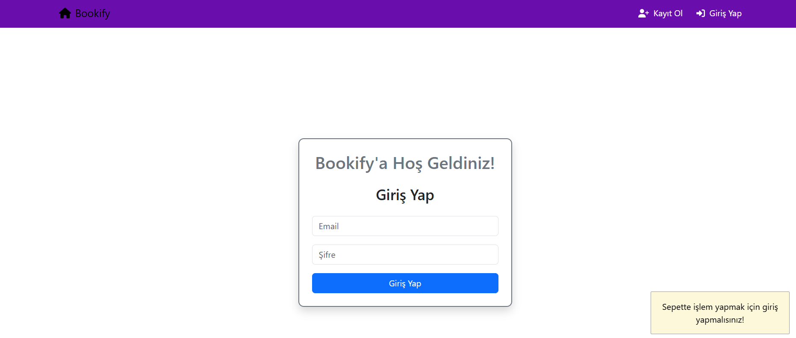
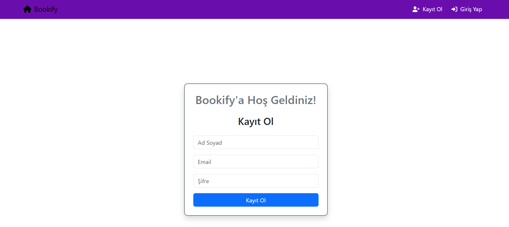
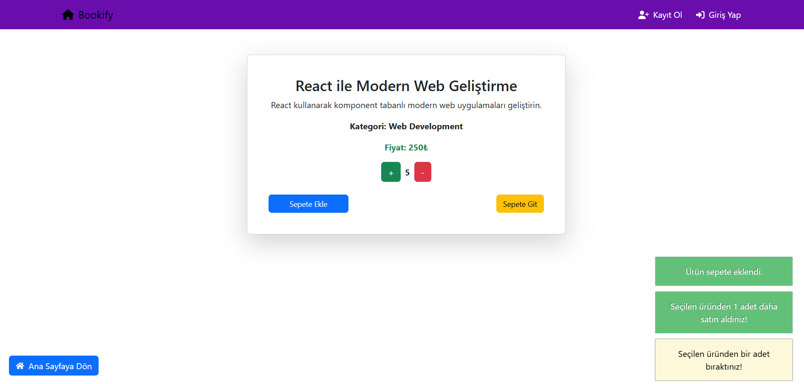
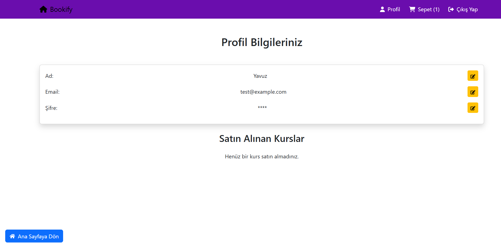
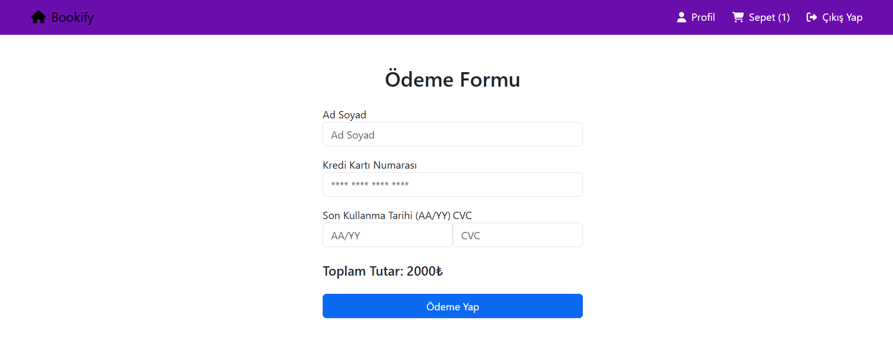
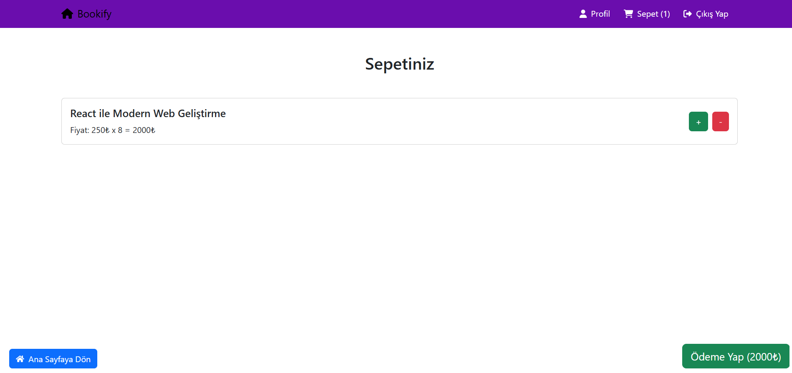

# Kurs Yönetim Sistemi

Bu proje, **ASP.NET Core** kullanılarak geliştirilen bir **Kurs Yönetim Sistemi** API'sini ve **React** ile geliştirilen bir **Frontend (FE)** yapısını içerir. Projede **JWT (JSON Web Token)** kullanılarak kimlik doğrulama ve yetkilendirme işlemleri yapılmıştır.

---

## Proje Yapısı

### Backend (ASP.NET Core)
- **InveonFinal.API:** API katmanı, controller'lar aracılığıyla endpoint'leri yönetir.
- **InveonFinal.Core:** İş kuralları, veri modelleri ve repository arabirimleri bulunur.
- **InveonFinal.Data:** Veritabanı işlemleri için `AppDbContext` ve EF Core migration dosyalarını içerir.
- **InveonFinal.Service:** Servis katmanı, DTO (Data Transfer Object) yapıları ve validasyon mekanizmalarını içerir.

### Frontend (React)
- React kullanılarak kullanıcı dostu bir arayüz geliştirilmiştir.
- **Sayfalar:**
  - Ana sayfa
  - Kullanıcı giriş/çıkış sayfası
  - Kurs listesi ve detay sayfası
  - Kullanıcıya özel kurs yönetim sayfası
  - Kayıt olma ekranı
  - Ödeme ekranı
  - Yönetici paneli

---

## Özellikler

- **Kimlik Doğrulama:** Kullanıcı giriş işlemleri JWT token ile yapılır.
- **Yetkilendirme:** Kullanıcı ve yönetici rolleri için farklı yetkilendirme seviyeleri uygulanır.
- **CRUD İşlemleri:** Kullanıcılar kurs ekleyebilir, düzenleyebilir ve silebilir. Yönetici onayı gerektiren işlemler ayrı endpoint'ler üzerinden yapılır.
- **Ödeme Sistemi:** Stripe vb. ödeme sistemine entegre edilmiştir (örnek ödeme akışı).
- **Validasyon:** Backend'de `FluentValidation`, frontend'de `React Hook Form` ile form doğrulaması yapılır.
- **Hata Yönetimi:** Hata mesajları kullanıcı dostu olacak şekilde gösterilir.

---

## Gerekli Kurulumlar

### Backend için
1. Projeyi klonlayın:
    ```bash
    git clone <repo-url>
    cd InveonFinal.API
    ```
2. `appsettings.json` dosyasını doldurun (veritabanı bağlantı dizesi, JWT Secret Key vb.).
3. Veritabanını migrate edin:
    ```bash
    dotnet ef database update
    ```
4. Projeyi çalıştırın:
    ```bash
    dotnet run
    ```

### Frontend için
1. Projeyi klonlayın:
    ```bash
    git clone <repo-url>
    cd frontend
    ```
2. Bağımlılıkları yükleyin:
    ```bash
    npm install
    ```
3. Çalıştırın:
    ```bash
    npm start
    ```

---

## Kullanıcı Rolleri

1. **Kullanıcı (User):**
   - Kurs kaydı yapabilir.
   - Kurs videolarını izleyebilir.
   - Kurs hakkında yorum bırakabilir.

2. **Eğitmen (Instructor):**
   - Yeni kurs oluşturabilir.
   - Kurs içeriklerini düzenleyebilir.
   - Kayıtlı öğrenci sayısını görebilir.

3. **Yönetici (Admin):**
   - Tüm kullanıcı ve kurs işlemlerini yönetebilir.
   - Ödeme raporlarını görüntüleyebilir.
   - Yorumları onaylayabilir/silebilir.

---

## Sayfa Görselleri

1. **Giriş Sayfası**
   


2. **Kayıt Ol Sayfası**
    


3. **Ana Sayfa**
   

4. **Kurs Detay Sayfası**
   

5. **Kullanıcı Profil Sayfası**
   

6. **Ödeme Sayfası**
   

7. **Sepet Sayfası**
    

---

## Kullanılan Teknolojiler

- **Backend:**
  - ASP.NET Core
  - Entity Framework Core
  - AutoMapper
  - FluentValidation
  - JWT Authentication
  - SQL Server

- **Frontend:**
  - React
  - Axios
  - React Router
  - Redux/Context API
  - Material-UI / Bootstrap

---

## Katkıda Bulunma

Projeye katkıda bulunmak için pull request gönderebilir veya issue açabilirsiniz.

---

## Lisans

Bu proje MIT lisansı ile lisanslanmıştır.

---
